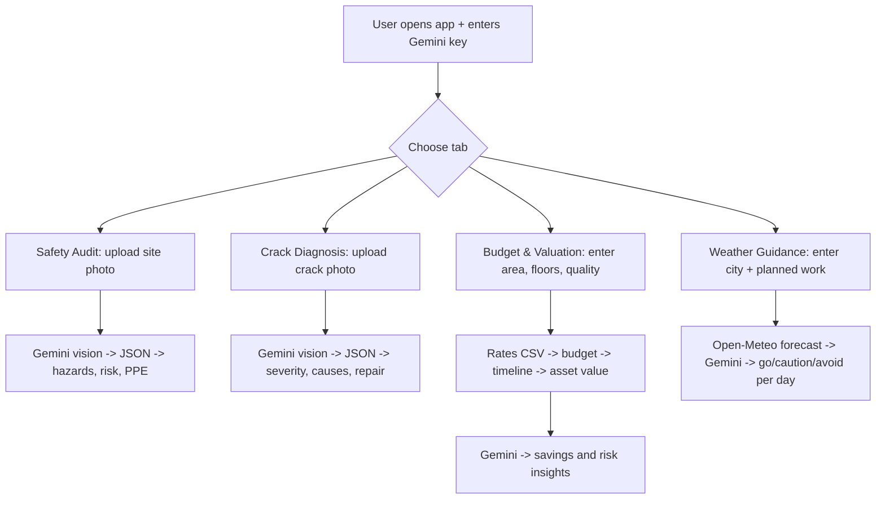

# Project Workflow

```mermaid
flowchart TD
    A[User opens app + enters Gemini key] --> B{Choose tab}
    B --> C[Safety Audit: upload site photo]
    B --> D[Crack Diagnosis: upload crack photo]
    B --> E[Budget & Valuation: enter area, floors, quality]
    B --> F[Weather Guidance: enter city + planned work]
    C --> G[Gemini vision -> JSON -> hazards, risk, PPE]
    D --> H[Gemini vision -> JSON -> severity, causes, repair]
    E --> I[Rates CSV -> budget -> timeline -> asset value]
    I --> J[Gemini -> savings and risk insights]
    F --> K[Open-Meteo forecast -> Gemini -> go/caution/avoid per day]
```

Build order followed in this repo: Setup -> Image analysis -> Planning & valuation -> AI layer -> UI + tests.
